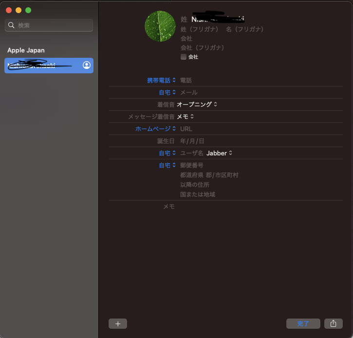

# autocompletion属性
「autocompletion属性」とは、ウェブフォームの自動入力機能を改善するための標準化された方法です。この機能を使用することで、ユーザーは住所をより迅速かつ正確に入力できます。HTMLのautocomplete属性を使用することで実現されます。

# 住所関連ののautocompletion属性

使い方は、住所の自動入力機能を実装する場合、各住所フィールドに対してautocomplete属性に特定の値を指定する必要があります。例えば、住所フィールドには"address-line1"、"address-line2"、"postal-code"、"country"などの値が指定できます。これにより、ユーザーが住所を入力する際に、自動的に候補が表示され、入力を支援することができます。

autocompletion属性を使うことで、ユーザーの利便性が向上し、入力ミスを減らすことができます。住所以外にも、電話番号やメールアドレスなどの入力にも応用できます。


住所の自動入力機能を実装するには、各住所フィールドに対してautocomplete属性に特定の値を指定する必要があります。以下は、住所フィールドに対して指定できるautocomplete属性の値の一覧です。

# 住所関連ののautocompletion属性

以下は、住所自動入力のためのautocomplete属性の一覧表です。この表には、各属性の説明と、iOSおよびAndroidの対応状況が示されています。

表にある主な属性は、「postal-code」や「country-name」、「address-level1」、「address-level2」、「street-address」などです。これらを使用することで、住所の自動入力がより正確になります。また、「address-line1」、「address-line2」、「address-line3」などの属性は、特定の条件下でのみ使用できます。

住所自動入力を実装する場合、各住所フィールドに対して適切なautocomplete属性を設定する必要があります。iOSおよびAndroidの両方でサポートされている属性は、「address-level1」と「address-level2」です。その他の属性については、iOSやAndroidでサポートされている場合がありますが、必ずしも両方でサポートされているわけではありません。

この表を参考に、自動入力機能を実装する際に必要な属性を正確に設定し、より便利で正確な住所入力を実現してください。

|autocomplete属性	|説明	|iOS|Android|
|---|---|---|---|
|postal-code	|郵便番号です。|	-|-|
|country	|国コードです。	|-|-|
|country-name	|国名です。	|-|-|
|address-level1|住所の一番上行政レベルです。これはふつう、住所がある都道府県です。合衆国では州になります。スイスでは、カートンになります。イギリスでは、ポストタウンになります。|都道府県|都道府県|
|address-level2|	少なくとも2段階の行政レベルがある住所において、2番目の行政レベルです。2つの行政レベルがある国では、これはふつう市町村や、住所のあるその他の地域を表します|市区町村|市区郡|
|address-level3|	少なくとも3段階の行政レベルがある住所において、3番目の行政レベルです。|	-|-
|address-level4|	住所が4段階まである場合のもっとも細かい行政レベルです。 |	-|-|
|street-address	|番地と建物名を含む住所. ※市町村名、郵便番号、国名は含めるべきではありません	|-|番地|
|address-line1|	住所のそれぞれの行です。これらは "street-address" が存在しない場合のみ置くことができます。　※street-addresがない場合のみ利用可能|番地|住所1行目|
|address-line2|	住所のそれぞれの行です。これらは "street-address" が存在しない場合のみ置くことができます。	※street-addresがない場合のみ利用可能|建物名など(オプション)|住所2行目|
|address-line3|	住所のそれぞれの行です。これらは "street-address" が存在しない場合のみ置くことができます。	※street-addresがない場合のみ利用可能|-|-|


以下は、これらの値を使用して実装された住所の自動入力機能のサンプルです。

html
```
<form>
  <label for="street-address">Street address:</label>
  <input type="text" id="street-address" name="street-address" autocomplete="street-address">
  <br>
  <label for="city">City:</label>
  <input type="text" id="city" name="city" autocomplete="address-level2">
  <br>
  <label for="state">State:</label>
  <input type="text" id="state" name="state" autocomplete="address-level1">
  <br>
  <label for="zip-code">Zip code:</label>
  <input type="text" id="zip-code" name="zip-code" autocomplete="postal-code">
</form>
このサンプルでは、autocomplete属性に適切な値が指定され、それによりユーザーが住所をより迅速かつ正確に入力できるようになっています。
```
# 利点
住所の自動入力機能には、いくつかの利点があります。

- ユーザーが入力する必要がある情報が少なくなるため、入力時間が短縮されます。
- ユーザーが入力する情報が正確になるため、間違いやタイポが減ります。


# Browserごとの設定

## Safari/Mac

1. Safariブラウザを開きます。
1. 「Safari」メニューから「環境設定」を選択します。
1. 「自動入力」タブをクリックします。
1. 「連絡先情報を使用」オプションにチェックを入れます。
2. 「連絡先情報」ボタンをクリックします。
3. 「連絡先」アプリが起動しますので、新しい住所を追加する場合は、「+」ボタンをクリックして住所を追加します。すでに住所が登録されている場合は、住所を選択して「OK」をクリックします。
   1. 

# 詳細情報

1. [w3.org](https://www.w3.org/WAI/WCAG21/Techniques/html/H98)
2. [Living Standard — Last Updated 8 March 2023](https://html.spec.whatwg.org/multipage/form-control-infrastructure.html#autofill)
3. [HTML 属性: autocomplete](https://developer.mozilla.org/ja/docs/Web/HTML/Attributes/autocomplete)
4. [ややこしい､フォームで使える住所系autocomplete属性の一覧と解説](https://blog.kentokanai.net/autocomplete/)
5. [autocomplete属性のものすごく簡単なメモ](https://momdo.hatenablog.jp/entry/20230204/1675497918)
6. [これだけは押さえよう！住所フォームの作り方](https://blog.kenall.jp/entry/address-form-best-practice)
7. [支払いフォームと住所フォームのベストプラクティス](https://web.dev/payment-and-address-form-best-practices/)
8. [アドレスフォーム](https://web.dev/learn/forms/address/)


# 参照

http://zipcloud.ibsnet.co.jp/rule/site
